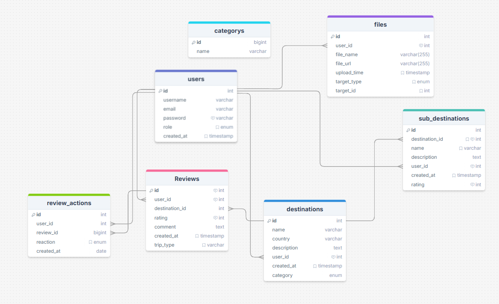

# FIND AND FLY PROJECT (On going)

Muutamien teknisten ongelmien vuoksi, sekä ajan loppumisen vuoksi.
Projekti on erittäin keskeneräinen. Mutta alla tähän mennessä toteutettuja asioita.

# Tietokannan kuvaus:

## Kuva tietokanta mallista:

# Tähän mennessä toteutettuja ominaisuuksia:

Backendiin tehty reiti kaikkiin ominaisuuksiin:

### File-server

Tallentaa kuvat serverille ja palauttaa responsena osoitteen ja muutetun file nimen

### Media-server

Hoitaa kaiken datan siirron ja tallennuksen tietokantaan;
Destinations: Hakee kaikki kohteet,
Categories: Sisältää kategoriat destinationeille (liitetty id:n avulla),
reviews: Tallentaa kaikki arvostelut destinationeista ja liittää ne toisiinsa,
sub_destinations: Voi tallentaa destinationin alle kyseisen kohteen ali nähtävyyksiä,
users: Perus käyttäjätiedot,
files: Voi tallentaa kuvat jotka liitetään target_type:n avulla tauluun sekä target_id:n avulla kyseisen taulun kohteeseen.

### Auth-server

Hoitaa käyttähäjän kirjautumisen sekä kaiken authentikointiin liittyvän

## IMPORTANT

# BACKEND

Just for future this is here:

If need to extend Express --> Request interface

### CONTENT:

create file: types>express>index.d.ts

declare module 'express-serve-static-core' {
interface Request {
userOrSomethingElse?: YourCustomTypeHere;
}
}

## tsconfig

{
"compilerOptions": {
"typeRoots": ["./types"]
}
}

typeRoots path depends on your folder structure and where tsconfig
and types folder is

Example: This project type folder is on root/shared/types and tsconfig on root/modules/auth-server/
